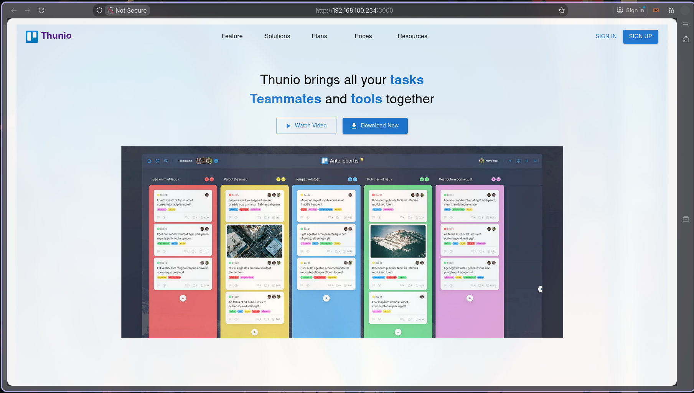
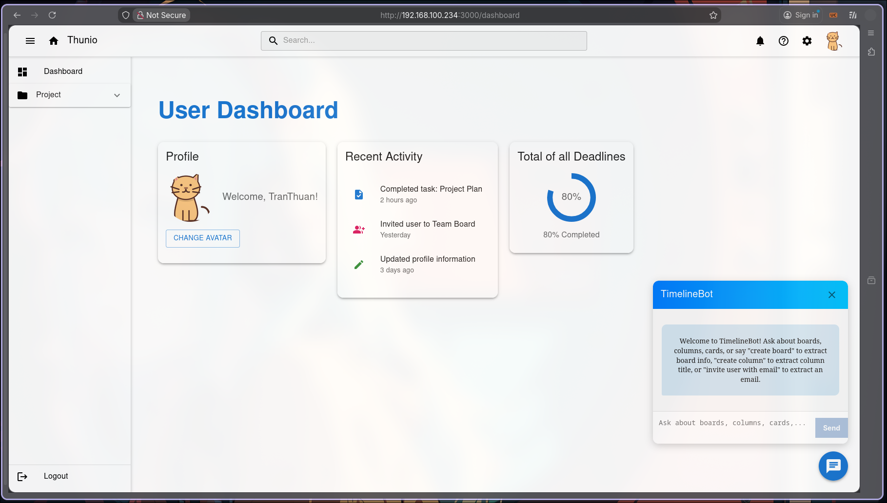
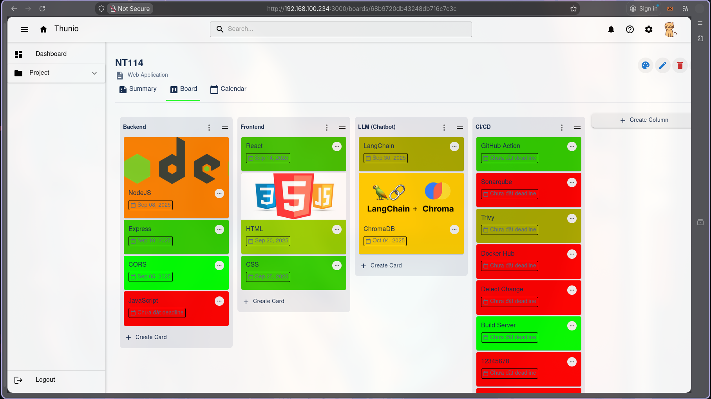
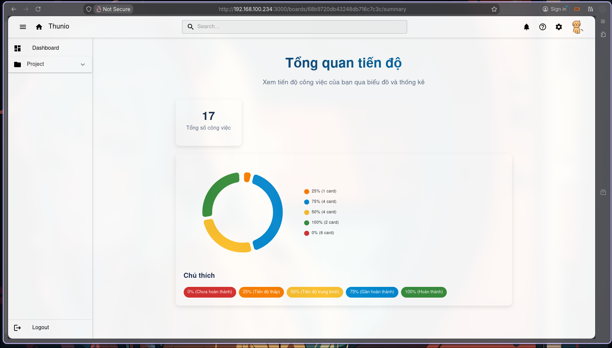
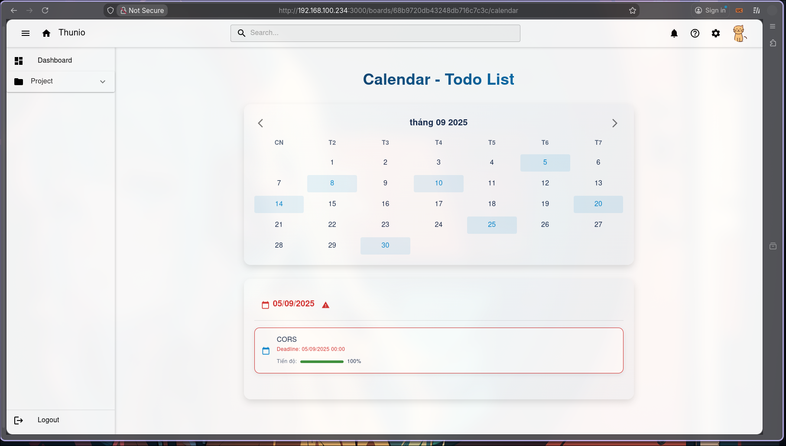

# Thunio – Team Collaboration Web Application

## 📌 Overview
Thunio is a web-based team collaboration and task management application, inspired by Trello.
It helps individuals and teams organize their work using boards, columns, and cards, while supporting real-time collaboration and intelligent assistance through an integrated chatbot.

The application is designed with a clean UI, intuitive workflows, and modern front-end technologies, making it suitable for academic projects, team productivity tools, and portfolio demonstrations.


## 📸 Application Demo
### 🏠 Home
The landing page provides quick access to user boards and recent activities.
<p align="center">  </p>

### 📊 Dashboard
The dashboard displays an overview of boards, collaboration status, and productivity insights.
<p align="center">  </p>

### 🧩 Board Detail
A detailed board view where users can manage columns and cards collaboratively.
<p align="center">  </p>

### 📝 Card Summary
Each card provides a summarized view of task information, status, and related metadata.
<p align="center">  </p>

### 📅 Calendar Card
Calendar-based visualization helps users track deadlines and scheduled tasks efficiently.
<p align="center">  </p>


## Key Features
### 🧩 Core Collaboration Features
- 📋 Create and manage Boards
- 🧱 Organize work using Columns (Lists)
- 📝 Create and manage Cards (Tasks)
- 👥 Invite members to boards and collaborate together
- 🔄 Flexible task organization inspired by Trello

### 👤 User Management
- 🔐 User authentication (Login / Register)
- 👤 Update user profile information
- 🔔 Notification system for collaboration activities

### 🤖 AI Chatbot (Advanced Feature)
#### Frontend
- Framework: ReactJS
- UI Library: Material UI (MUI)
- Styling: CSS
- State Management: React Hooks
- Architecture: Component-based design

#### CI/CD
- GitHub Actions – CI/CD automation
- SonarQube – Code quality analysis
- Trivy – Security vulnerability scanning
- Docker – Image build and distribution
- Docker Hub – Image registry

## 📁 Project Structure
The project follows a feature-based structure, where each domain feature is isolated for better scalability and maintainability.
```
thunio/
├── public/
│   └── index.html                # HTML entry point
│
├── src/
│   ├── assets/                   # Static assets
│   │   ├── 404/                  # Not Found assets
│   │   └── Home/                 # Home page assets
│   │
│   ├── components/               # Shared & reusable UI components
│   ├── constants/                # Application-wide constants
│   ├── customLibraries/          # Custom or wrapped third-party libraries
│
│   ├── features/                 # Feature-based modules
│   │   ├── ai/                   # AI chatbot feature
│   │   ├── boards/               # Board-related logic & UI
│   │   ├── columns/              # Column (list) feature
│   │   ├── cards/                # Card (task) feature
│   │   ├── invitations/          # Board invitation system
│   │   └── users/                # User-related features
│
│   ├── hooks/                    # Custom React hooks
│   │   ├── useAuth.js            # Authentication hook
│   │   └── useForm.js            # Form handling hook
│
│   ├── services/                 # API & external service layer
│   │   └── axiosConfig.js        # Centralized Axios configuration
│
│   ├── utils/                    # Utility functions
│   │   ├── RouteUtils.js
│   │   ├── apiHelper.js
│   │   ├── toastUtils.js
│   │   └── validateUtils.js
│
│   ├── App.js                    # Root application component
│   ├── index.js                  # Application entry point
│   └── styles.css                # Global styles
│
├── Dockerfile                    # Docker image definition
├── docker-compose.yml            # Local container orchestration
├── sonar-project.properties      # SonarQube configuration
├── package.json
├── package-lock.json
└── README.md
```

## ✅ Prerequisites
- **Node.js**: Version 14.x or higher  
- **npm**: Node.js package manager (version 6.x or higher)  
- **Web Browser**: Modern browser (Chrome, Firefox, Edge)  


## ⚙️ Installation & Setup

### 1. Clone the Repository
```bash
git clone https://github.com/facebook/create-react-app.git
cd NT114-MicroServices-FE
```

### 2. Install Dependencies
```bash
npm install
```

### 3. Configure Environment Variables (Optional)
Create a `.env` file in the project root to customize the development server port or other settings:
```bash
PORT=3000
```

### 4. Run the Development Server
```bash
npm start
```
This starts the app in development mode. Open [http://localhost:3000](http://localhost:3000) to view it in your browser. The page will reload automatically when you make changes.

## 🔁 Development Workflow
1. A developer creates a feature branch from `main`
```bash
git checkout -b feature/your-feature
```
2. After completing the feature, a Pull Request (PR) is created into `main`
3. When a PR is opened, the CI pipeline is automatically triggered
4. Only after all CI checks pass, the PR is allowed to be merged into `main`
5. Once merged into `main`, changes are merged into `production`
6. Merging into `production` triggers the CD pipeline, which builds and pushes Docker images

## ⚙️ Continuous Integration (CI)
The CI pipeline runs automatically on Pull Requests targeting `main` and includes the following stages:
### 1. Detect Change
- Identify whether the changes affect critical parts of the project
- CI steps are skipped if no relevant files are modified

### 2. Build
- Build the application only when meaningful changes are detected

### 3. Code Quality Analysis (Sonarqube)
- Static code analysis
- Detect bugs, code smells, and maintainability issues

### 4. Security Scanning (Trivy)
- Scan dependencies and images for known vulnerabilities

### 5. Pipeline Summary
- Aggregate results from all CI steps
- Provide a clear pass/fail overview for reviewers

**🔒 Only PRs that pass all CI stages can be merged into `main`**


## 🚀 Continuous Deployment (CD)
The CD pipeline is triggered automatically when code is merged into the `production` branch.
CD responsibilities include:
### 1. Build Docker Image
- Build a production-ready image of the Thunio application

### 2. Push image to Docker Hub
- Publish the image to Docker Hub for deployment or distribution

This ensures that the `production` branch always reflects a deployable and stable version of the application.


## 📌 CI/CD Benefits
- ✅ Prevents unstable code from reaching production
- 🔍 Ensures code quality and security at every PR
- ⚡ Optimizes pipeline execution by building only when necessary
- 🚢 Automates deployment via Docker Hub

## 📈 Workflow Diagram (Optional)
```
feature/* 
   ↓ (Pull Request)
  main
   ↓ (CI: Detect → Build → SonarQube → Trivy → Summary)
  production
   ↓ (CD: Build Image -> Push Image)
Docker Hub
```


## 🧪 Available Scripts
**Start Development Server**:
  ```bash
  npm start
  ```
Runs the app in development mode with hot reloading.

**Run Tests**:
  ```bash
  npm test
  ```
Launches the test runner in interactive watch mode.

**Build for Production**:
  ```bash
  npm run build
  ```

## 🎯 Use Cases
- Team task management
- Group project collaboration
- Academic project demonstration
- Portfolio showcase
- Trello-inspired workflow systems

## 🌟 Future Improvements
- Real-time collaboration with WebSockets
- Role-based permissions
- Activity logs and audit history
- Enhanced AI chatbot capabilities

## 👤 Author
- Project Name: Thunio
- Author: Tran Van Thuan
- Email: thuantranuit2004@gmail.com
- Github: https://github.com/thuan410

## 📄 License
This project is licensed under the MIT License.
